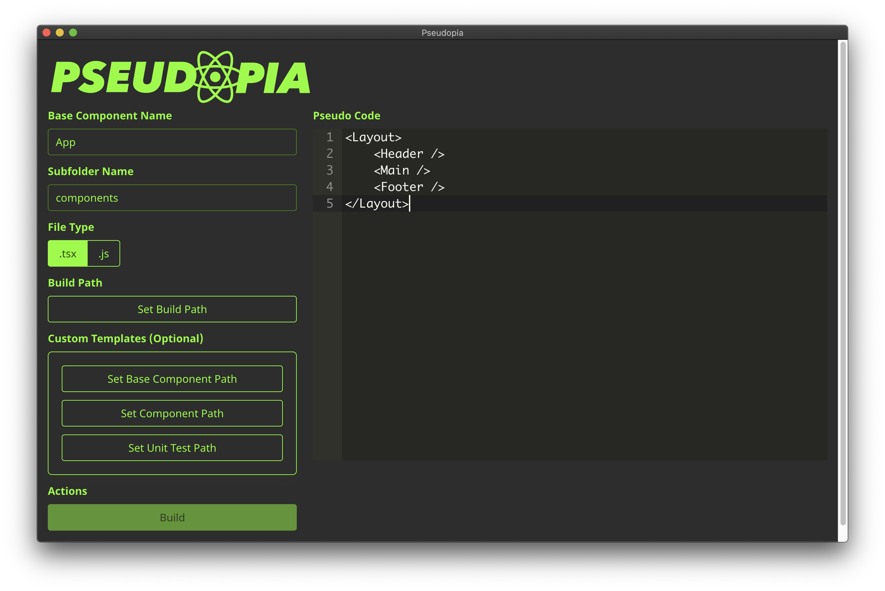

# Pseudopia App



> Write pseudo React, get components.

## Features

👟 Fast - Quickly build out your app ideas 

👍🏻 Easy - Templates are built-in, just write pseudo React - get components

⚙️ Customizable - Create your own Handlebar templates for Pseudopia to use

📺 [Watch a quick video](https://res.cloudinary.com/setholito/video/upload/v1600137138/pseudopia/pseudopia-intro-short.mp4)

## Example

Pseudo code:

```
<Layout>
    <Header />
    <Wrapper>
        <MainContent />
    </Wrapper>
    <Footer />
</Layout>
```

Generates:

```
./your-directory/
├── App.tsx
└── components
    ├── Footer.tsx
    ├── Header.tsx
    ├── Layout.tsx
    ├── MainContent.tsx
    ├── Wrapper.tsx
    └── __tests__
        ├── Footer.test.tsx
        ├── Header.test.tsx
        ├── Layout.test.tsx
        ├── MainContent.test.tsx
        └── Wrapper.test.tsx
```

## Getting Started

```
npm i && npm start
```

## Customization

Pseudopia allows you to use your own Handlebar templates.
Currently, templates require at least one piece/key of data to be handed off to Handlebars.

See tables below.

### Variables for Base Component Handlebar template ([Example](src/hbs-templates/base-component.hbs))

| Key       | Type                                                | Description                                           |
| --------- | --------------------------------------------------- | ----------------------------------------------------- |
| extension | `string`                                            | File extension type - `js`, `tsx`                     |
| imports   | `{ childName: string, componentDirName: string }[]` | Must have a key of `childName` and `componentDirName` |
| name      | `string`                                            | Name of base component                                |
| render    | `string`                                            | Content from the Pseudopia code editor                |

### Variables for Component Handlebar template ([Example](src/hbs-templates/component.hbs))

| Key       | Type       | Description                       |
| --------- | ---------- | --------------------------------- |
| extension | `string`   | File extension type - `js`, `tsx` |
| name      | `string`   | Name of component                 |
| props     | `string[]` | Component props                   |

### Variables for Unit Test Handlebar template ([Example](src/hbs-templates/unit-test.hbs))

| Key  | Type     | Description       |
| ---- | -------- | ----------------- |
| name | `string` | Name of component |

## Contributing

Seeking code reviews, feedback, and open to contributions
