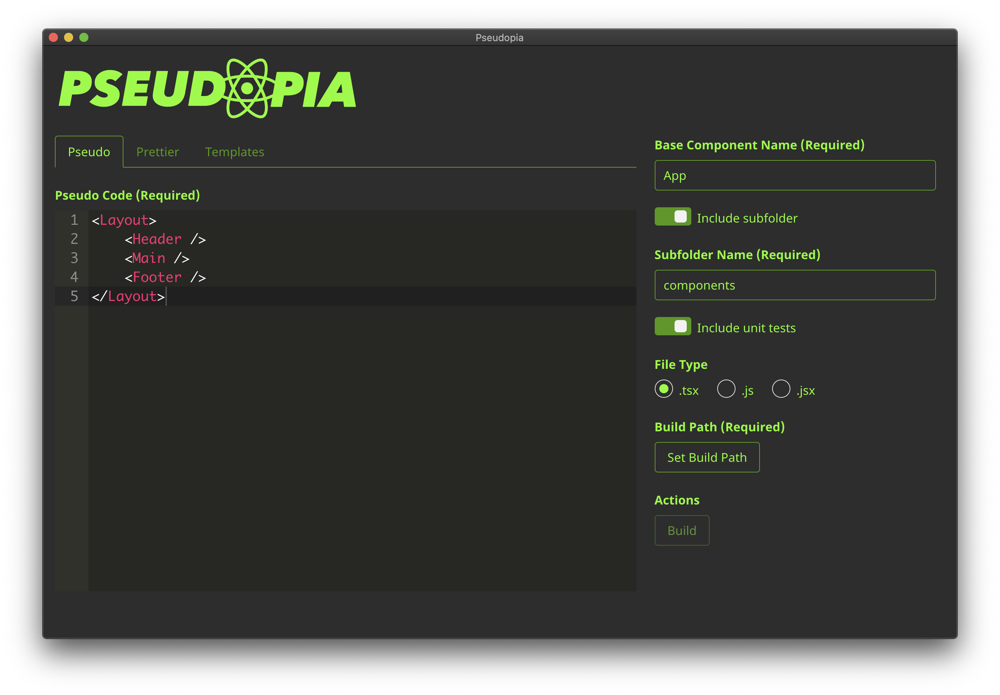

# Pseudopia App

> Write pseudo React, get components.



## Example

Pseudo code:

```
<Layout>
    <Header />
    <Wrapper>
        <MainContent />
    </Wrapper>
    <Footer />
</Layout>
```

Generates:

```
./output/
├── App.tsx
└── components
    ├── Footer.tsx
    ├── Header.tsx
    ├── Layout.tsx
    ├── MainContent.tsx
    ├── Wrapper.tsx
    └── __tests__
        ├── Footer.test.tsx
        ├── Header.test.tsx
        ├── Layout.test.tsx
        ├── MainContent.test.tsx
        └── Wrapper.test.tsx
```

## Getting Started

```
npm i && npm start
```

## Contributing

Seeking code reviews, feedback, and open to contributions
